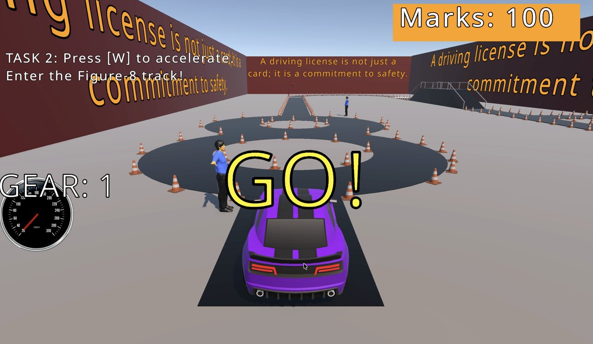
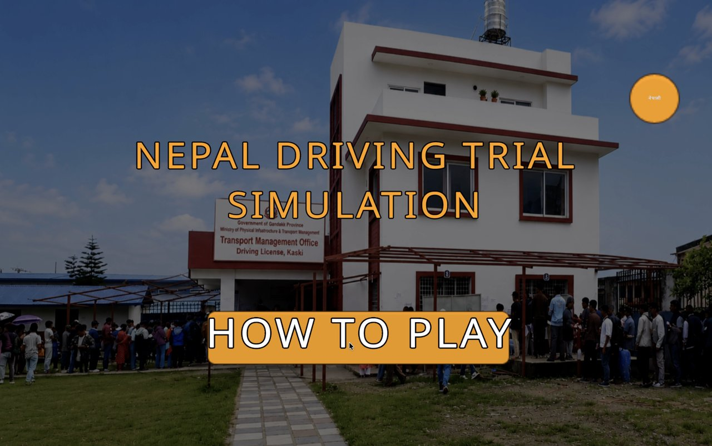
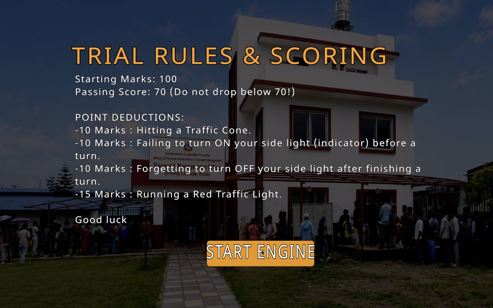
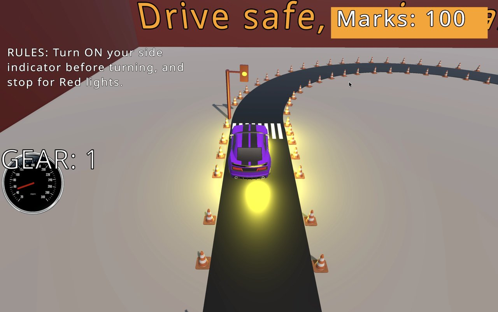
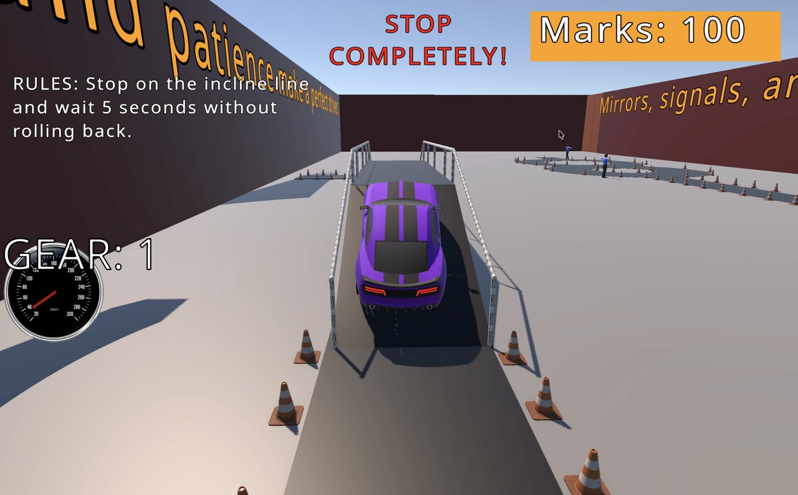
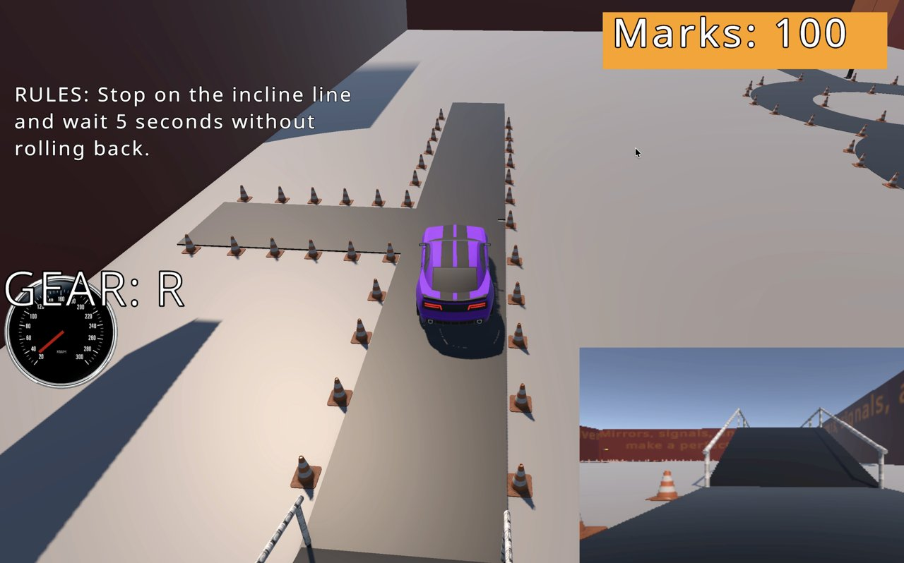

# 🚗 Nepal Driving License Practical Test Simulator

A 3D driving simulator built in **Unity (C#)** that recreates Nepal's practical driving license trial, so learners can practise the real test before they take it.

The test track is set in a **Pokhara driving office** environment and follows the official trial: figure-8, L-back (reverse), slope stop, cones, indicators and traffic lights, with a 100-mark scoring system and a passing score of 70.



---

## 📸 Screenshots

| Main menu (English / नेपाली) | Trial rules & scoring |
|---|---|
|  |  |
| **Zebra crossing & traffic light** | **Slope stop** |
|  |  |
| **L-Back in reverse, with rear-mirror view** | **Figure 8** |
|  |  |

---

## ✨ Features

- **Manual transmission car**: clutch, gear up/down, reverse, handbrake and RPM-based engine sound
- **Official trial sections**
  - **Figure 8**: checkpoints must be driven in the correct order
  - **L-Back**: reverse into the L-bay
  - **Slope stop**: hold the car still on the slope for 5 seconds
  - **Zebra crossing with traffic lights**: red / yellow / green light cycle
  - **Traffic cones** along the track
- **Indicator checks**: turn your side light on before a turn and off after it
- **Live scoring** with on-screen marks and a pass/fail screen
- **Tutorial + quiz**: learn the controls, then answer questions before the test starts
- **On-screen task and rule hints** guide you through each section of the trial
- **English / नेपाली language toggle** for menus, rules, quiz and scoring
- **Multiple camera views** and a reverse mirror feed
- **On-screen mobile buttons** for touch devices

## 📋 Scoring Rules

You start with **100 marks** and need **70 or more** to pass.

| Mistake | Penalty |
|---|---|
| Hitting a traffic cone | −10 |
| Not turning ON the indicator before a turn | −10 |
| Not turning OFF the indicator after a turn | −10 |
| Running a red light at the zebra crossing | −15 |
| Skipping the L-Back | ❌ Instant fail |
| Wrong direction or leaving the Figure 8 early | ❌ Instant fail |
| Not waiting 5 seconds on the slope | ❌ Instant fail |

## 🎮 Controls

| Key | Action |
|---|---|
| **W** | Throttle / gas |
| **S** | Foot brake |
| **A / D** | Steer left / right |
| **Space** | Handbrake |
| **Left Shift** (hold) | Clutch (must hold to change gears) |
| **E** | Shift gear up |
| **Q** | Shift gear down (down to **R** for reverse) |
| **← / →** | Left / right indicator on/off |
| **C** | Change camera view |

## 🛠️ Built With

- **Unity 6** (6000.3.21f1) with the Universal Render Pipeline
- **C#** for all gameplay scripts
- **TextMeshPro** for UI and Nepali text

## 🚀 How to Run

1. Install **Unity Hub** and Unity **6000.3.21f1** (or a newer Unity 6 version).
2. Clone this repository:
   ```bash
   git clone https://github.com/Healergrg/Nepal-Driving-Test.git
   ```
3. In Unity Hub, click **Add → Add project from disk** and select the cloned folder.
4. Open the scene **`Assets/Scenes/Pokhara Driving Office.unity`** and press **Play**.

## 📂 Project Structure

```
Assets/
├── MyFolder/
│   ├── Scripts/     # All gameplay code (car controller, rules, scoring, UI, language)
│   ├── prefabs/
│   ├── Materials/
│   └── Sound/
└── Scenes/
    ├── Pokhara Driving Office.unity   # Main scene
    └── Nepal Driving Test.unity
```

Key scripts:

| Script | What it does |
|---|---|
| `ProManualCarController.cs` | Manual-gearbox car physics and input |
| `GameManager.cs` | Marks, countdown, pass/fail logic |
| `Figure8Manager.cs`, `LBackManager.cs`, `SlopeStopCheck.cs` | Trial section rules |
| `ConeCollisionRule.cs`, `ZebraCrossingRule.cs`, `IndicatorCheckZone.cs` | Penalty rules |
| `TrafficLightController.cs` | Traffic light cycle |
| `TutorialQuizManager.cs`, `LanguageManager.cs` | Tutorial quiz and English/Nepali UI |

## 🙏 Credits

Third-party assets used in this project:
- Unity **Starter Assets**
- **Brick Project Studio** (building and interior assets)
- **Fence Modular System**

All rights to these assets belong to their original creators.

## 👤 Author

**Pasang Dorje Gurung**: Computing student, University of Wolverhampton (Fishtail Mountain College, Pokhara)

[LinkedIn](https://www.linkedin.com/in/pasang-dorje-gurung) · [GitHub](https://github.com/Healergrg)
